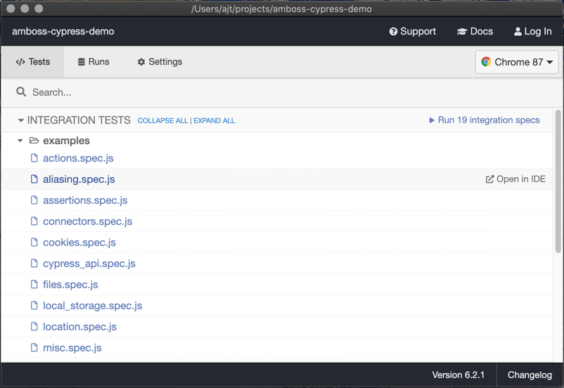
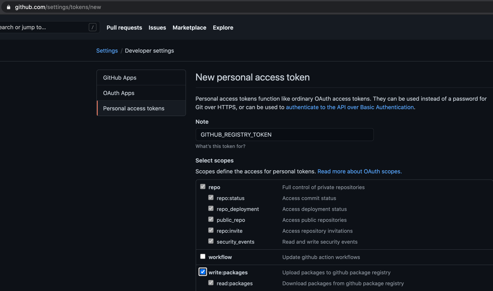
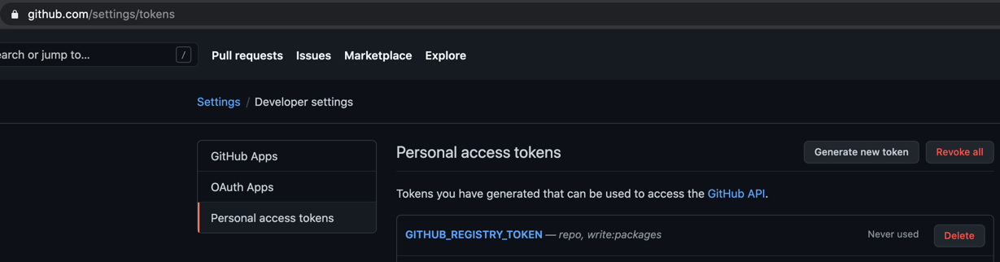
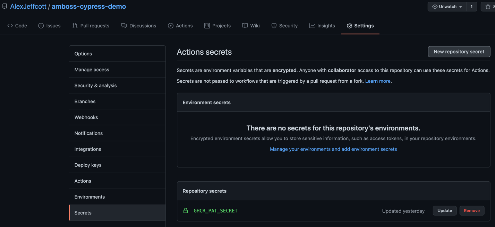
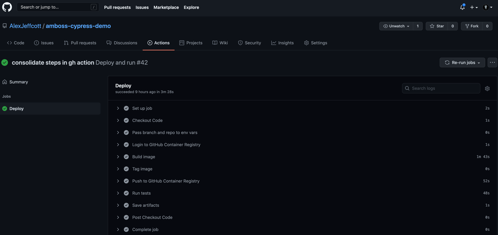
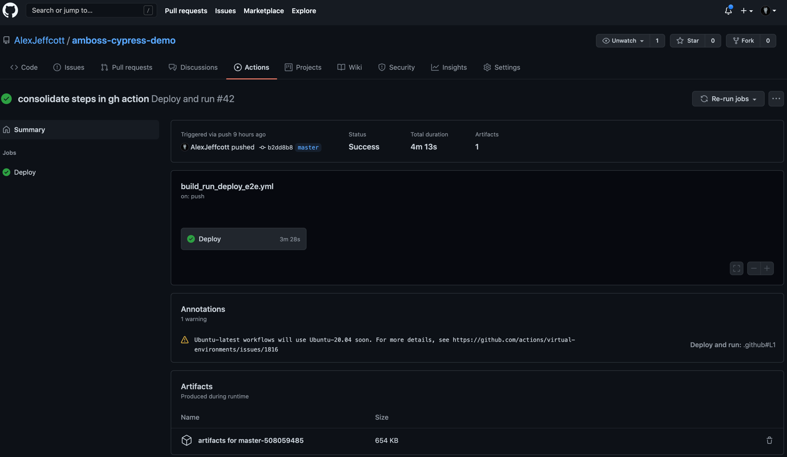
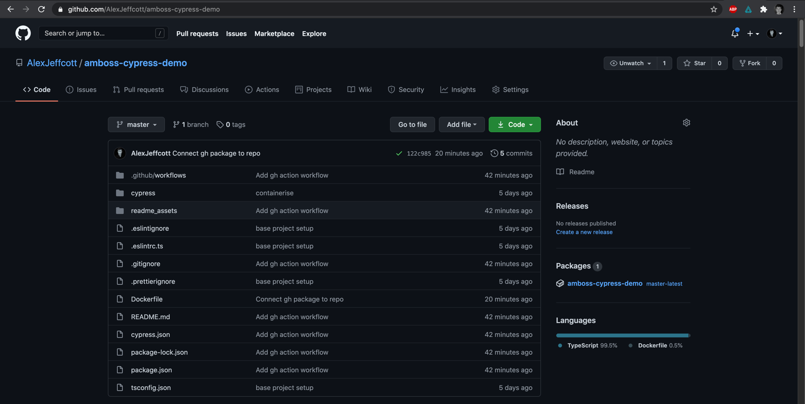

# Value and Quality: An Epic Story Of End-to-End Testing Architecture

## TL;DR
End-to-end testing is often equated with the frontend and often resides in the frontend codebase. I believe this is a significant mistake with a specific solution.

## What this article is about
The first part of this article will define the problem and lay out a proposed solution.

The second part details how this can be achieved with a test runner, automation server and container registry. This article will demonstrate this using Cypress, GitHub Actions and the GitHub Container Registry. However, whether you choose this stack or Selenium, Jenkins and Google Cloud Registry or Puppeteer, CircleCI and Docker Hub the overall problem and solution will be the same.

### Caveats, Caves and the Limitations of this Article
**The Cypress tests themselves won't be discussed** so, please, don't expect lots of examples and discussion on what and how to test. Excellence in test suite execution is important, of course, but it is out-of-scope.

**The CI implementation won't be discussed in detail** so, please, don't expect a highly optimised GitHub Actions workflow. The specifics of a proper CI implementation is important, of course, but it is out-of-scope.

## Defining the Solution and the Problem
To cut a long story short, end-to-end tests should not be kept in the frontend repository (monorepo architectures aside). The default position should be for e2e applications to be regarded as a software project that should stand on its own.

### A real-world example
Let us imagine, for simplicity's sake, that a company has a frontend, and a backend which work harmoniously to create a web application.

Let us also imagine that the backend holds back its changes in a staging environment prior to a twice weekly deployment.

Let us further imagine that there are backend changes, which will result in an unhandled Javascript exception, ready and waiting to be deployed to the live environment tomorrow. Some small misalignment or unintentional misimplementation of the data contract could be more than sufficient to cause this. The change has just been deployed to the staging environment, so has not yet resulted in a broken web application and a new critical bug event for your up-time metrics dashboard.

Let us continue by imagining that the frontend starts their master deployment pipeline with a host of irrelevant changes.

When the frontend CI runs the e2e in the staging environment, the tests will fail despite there being no relevant changes to the frontend code.

#### What happens next?
Unfortunately, I imagine that the tendency here would be to notice that the test that is failing refers to some part of the codebase which was not touched by the frontend. The natural and quite commonplace assumption from there is that this shows that the tests are not sufficiently deterministic, and the best 'solution' would be to re-run the pipeline with crossed fingers. Needless to say that this is a huge waste of time, incorrectly erodes confidence, and causes frost crystals to creep over my heart.

After some time and possibly further useless re-runs and investigation and wrangling and the involvement of frontend, QA and backend the issue is somehow resolved. Everyone breaths a sigh of relief and returns to the status quo, the damage being done and people needed to get back 'to their day job', until next time...

#### So what went wrong?
It is not coherent that this bug be caught while deploying the frontend to the live environment - frontenders debugging the root cause then passing it to backenders who would then either pass it back to frontenders who would have to adjust frontend code to reflect the new return value before being able to deploy, or revert or hotfix the change.

It would be better if this breaking, albeit correct and desired, change be flagged up faster and more clearly 'post hoc' in the backend PR pipeline. Had this occurred, a breaking change in the backend code would have been correctly associated with the failing e2e test. From this standpoint, the backend engineer who owns the PR would align and coordinate with a trusted frontend friend and that would be trivially the end of that.

Now imagine if the fairly simple example architecture of the project included multiple frontends, backends, microservices, guilds, chapters and teams. The problem would be far worse, but the solution would remain simple, powerful and natural. 

### Why extract?
#### Velocity of delivery
Good e2e coverage increases the confidence that we can make changes without improperly impacting stakeholders (be they data, other developers or end users). Without good testing, developers will tend to be, at best, overly tentative and defensive, and at worse resigned to blocked pipelines, and p0 bug events.

#### Speed of recovery
When an e2e failure occurs, that should happen as closely as possible to the cause of failure - both in time and code/workflow. What I mean by this is that a change in the return of a REST endpoint (even with 100% test coverage, as the tests will be updated to reflect the changes - the endpoint is doing what it should do, after all) could potentially break the user's experience (a potential critical bug) or, more subtly, erroneously alter values passed in tracking events (a potential BI disaster).

#### Natural simplicity while scaling vertically and horizontally
It is surely a truism to say that architectures which encourage robust, simple implementations while scaling to the heavens and horizon are worth favouring. With an e2e application which is properly extracted and containerised, running the latest, or some particular, image in any and every pipeline or developer machine feels intuitive.

#### Philosophical reasons
In my opinion, e2e testing by definition is not owned by the frontend, or indeed any one end, of a software project. It should reflect the reality of the product which is being delivered to its users.

While it is certainly possible to keep e2e in the frontend codebase and also to deploy it as a container to be consumed by other CIs, I have found that doing so weds it to the frontend in the hearts and minds of other codebases.

#### Autonomy of automation
Those engineers who have ownership of e2e tests and testing should be empowered to choose their own stacks, tooling, coding standards and implementations.

## Workflows
One concern about this approach is that it is too difficult to develop a feature and write or update a related test at the same time.

While I understand this concern, it is worth noting that this would only be different for frontenders, which is somewhat telling. It is also no different from the backend and frontend needing to coordinate changes to the data contract. I don't see many advocating for the frontends and backends and microservices to reside in the same codebase (again, monorepos aside).

One solution which has been effective here at AMBOSS, is to ensure that the corresponding branches in the e2e and frontend repos match. When the developer is ready to merge both, they do it at approximately the same time. The specifics of this are outside the scope of this article.

## Let's do it
### Caves and Requirements:
I am doing this up on macOS but will try to keep things portable.
- a text editor - [get one here](https://code.visualstudio.com/download)
- node >14 and npm >6 - [get it here](https://nodejs.org/en/download/)
- docker desktop - [get it here](https://www.docker.com/products/docker-desktop)
- a GutHub account - [get it here](https://github.com/)
- a docker registry (we use [gcr](https://cloud.google.com/container-registry?hl=en) at AMBOSS but will use [GitHub Container Registry](https://github.blog/2020-09-01-introducing-github-container-registry/) for the purposes of this post)
- a CI solution (we mostly use [Jenkins](https://www.jenkins.io/) at AMBOSS atm, but will use [GitHub Actions](https://docs.github.com/en/actions/learn-github-actions) for the purposes of this post)

### Setting up config files and environment
For this project we will be using fairly standard configurations for Eslint, Prettier, and Typescript. Please setup your text editor accordingly. The most important thing is that they play well together (no erroneous errors or special workarounds) and make your life easier (type annotations and autocompletion).
```shell
mkdir amboss-cypress-demo && cd $_
echo "An AMBOSSian Cypress Demo" >> README.md
printf ".code\n.idea\n.env\ncypress/videos/**\ncypress/screenshots/**\nnode_modules" >> .gitignore
printf ".code\n.idea\nnode_modules\npackage-lock.json" >> .prettierignore
printf ".code\n.idea\nnode_modules\npackage-lock.json" >> .eslintignore
git init
npm init -y
```
Let's create a pretty minimal eslint config:
```shell
touch .eslintrc.js
```
Add this to the file we just created:
```js
module.exports = {
    env: {
        browser: true,
        es2020: true,
        node: true,
    },
    extends: [
        'eslint:recommended',
        'plugin:@typescript-eslint/recommended',
        'prettier/@typescript-eslint',
        'plugin:prettier/recommended',
        "plugin:cypress/recommended",
    ],
    parser: '@typescript-eslint/parser',
    plugins: ['@typescript-eslint', 'prettier'],
    rules: {
        'prettier/prettier': 'error',
    },
}
```
Finally, let's set up the Typescript config:
```shell
touch cypress/tsconfig.json
```
Add this to the file we just created:
```json
{
  "compilerOptions": {
    "strict": true,
    "target": "es5",
    "lib": ["es6", "dom"],
    "types": ["cypress"]
  },
  "include": ["**/*.ts"]
}
```

#### Install the dependencies
As this is a Cypress application that will be running 'non-transpiled' Typescript, it makes sense for both Cypress and Typescript as production dependencies. The same will apply to any special functionality (such as [cypress-image-snapshot](https://github.com/jaredpalmer/cypress-image-snapshot)) that you add.

**production dependencies**
```shell
npm i typescript cypess
```
Development dependencies like linting plugins and type definitions aren't directly needed for the Cypress application to run correctly.

**dev dependencies**
```shell
npm i -D @typescript-eslint/parser @typescript-eslint/eslint-plugin eslint-plugin-cypress @types/node @types/mocha @types/chai @types/babel__core eslint eslint-config-prettier eslint-plugin-prettier prettier
```
Now that we have everything installed, let's run Cypress for the first time.
```shell
npx cypress open
```

This will open the Cypress UI with a bunch of example tests, which I was super impressed with when I first saw it, btw.


You should now have the following file and folder structure in your project:

```shell
./amboss-cypress-demo
├── README.md
├── cypress
│   ├── fixtures
│   │   └── example.json
│   ├── integration
│   │   └── examples
│   │       ├── actions.spec.js
│   │       ├── aliasing.spec.js
│   │       ├── assertions.spec.js
│   │       ├── connectors.spec.js
│   │       ├── cookies.spec.js
│   │       ├── cypress_api.spec.js
│   │       ├── files.spec.js
│   │       ├── local_storage.spec.js
│   │       ├── location.spec.js
│   │       ├── misc.spec.js
│   │       ├── navigation.spec.js
│   │       ├── network_requests.spec.js
│   │       ├── querying.spec.js
│   │       ├── spies_stubs_clocks.spec.js
│   │       ├── traversal.spec.js
│   │       ├── utilities.spec.js
│   │       ├── viewport.spec.js
│   │       ├── waiting.spec.js
│   │       └── window.spec.js
│   ├── plugins
│   │   └── index.js
│   └── support
│       ├── commands.js
│       └── index.js
├── cypress.json
├── tsconfig.json
├── package-lock.json
└── package.json
```

You will have noticed that this step creates a whole host of test files, a file structure, and a `cypress.json` file and then open the testing ui.

Let's clean this up a bit first by changing all the .js files to .ts files.
```shell
find . -name '*.js' -exec bash -c 'mv "$0" "${0%.js}.ts"' "{}" \;
```
Additionally, when you take a look at the spec files in 'cypress/integration' you will notice the line '/// <reference types="cypress" />' at the top of the file. This is used as a signal to your IDE to use Cypress types in the file, but because of the line '"types": ["cypress"]' in your tsconfig.json, this is not needed. Feel free to remove or ignore those lines.

Now that the base setup is complete you have a cypress installation with a linting, formatting and typescript along with a bunch of examples and in the standard folder structure (which I recommend you stick to).

Now that this is done it might be time to `git commit` so we can get going with the docker setup.

### Containerising
First, let's add a dockerfile and the config:
```shell
touch Dockerfile
```
Add this to the file we just created:
```dockerfile
FROM cypress/base:14.15.4

COPY cypress.json .
COPY tsconfig.json .
COPY package.json .
COPY package-lock.json .
COPY ./cypress/ cypress

RUN npm ci --production

ENTRYPOINT ["npx", "cypress", "run", "--config-file"]
```
In the first line we use the official minimal image from Cypress which comes with node 14.15.4.

The COPY steps copy the cypress folder, and necessary config file into the image - pretty straightforward. I do prefer to copy the config files one-by-one, it just feels clearer, to me, what is included and what is not.

We then install the 'production' dependencies. At this moment the only thing that needs to be installed in order to run the tests properly is Typescript and Cypress. As I mentioned before, if you add some other capabilities to your tests later, such as `cypress-file-upload`, then you would add this to your production dependencies. As an aside, being able to install the dependencies in this way, is a pleasingly natural consequence of having e2e in a separate dedicated repo as a stand-alone software project.

Finally, we run Cypress against Electron (the default from Cypress) in its non-user interface mode as this is what will be used in CI (fyi opening the UI from a container is possible but is fiddly and constitutes a blog post all of its own!). Notably it is ready to take a config file as an argument.

If you run `docker build -t e2e_image .` (don't forget the full stop!!!) then you should end up with something like the following in your terminal output.

```shell
Step 4/4 : ENTRYPOINT ["npx", cypress", "run", "--config-file"]
---> Running in b6f2be420ca9
Removing intermediate container b6f2be420ca9
---> 5ad724c997ac
Successfully built 5ad724c997ac
Successfully tagged e2e_image:latest
```
Now let's run the Cypress tests.
```shell
docker run --rm e2e_image cypress.json
```
These should all pass successfully, which is super.

Now might be a good time to add some npm scripts to create an 'api' for users of the application - in other words, the QA Engineers and developers who will be using it. Simply add the below to the 'scripts' section of your package.json so you can, for example, open the tests with UI by running `npm run cypress:open`.
```json
"cypress:clear": "cypress cache clear",
"cypress:build": "docker build --no-cache -t e2e_image .",
"cypress:explore": "docker run -it --entrypoint sh --rm e2e_image",
"cypress:run": "docker run --rm e2e_image cypress.json",
"cypress:open": "cypress open --config-file cypress.json"
```
Clear and declarative and easy to use, imo.

#### Getting the artifacts
You may have noticed that you won't get to see the video or screenshot artifacts as they get saved in the docker container. Let's fix that by adding some volumes to the `cypress:run` npm script.
```json
"cypress:run": "docker run --rm -v $(pwd)/cypress/videos:/cypress/videos -v $(pwd)/cypress/screenshots:/cypress/screenshots e2e_image cypress.json"
```
If you `npm run cypress:run` again, you will notice mp4s popping into `cypress/videos`.

Now that docker is set up, and we have some declarative npm scripts defined, it seems like a good time to `git commit` and move on to getting this into CI.

### Running in CI
We mostly use Jenkins at AMBOSS but for the purposes of this blog post I will be using Github Actions and GitHub Container Registery, so you will need a GitHub account.

#### GHCR Open Beta
To have GitHub Container Registry feature enabled (currently (January 2021) in open Beta). To do this login to [GitHub](https://github.com/), click on the account menu (prob your picture in the top right), open the 'Feature Preview' modal and enable it.
  
#### Auth and permissions
You should also create a Personal Access Token (PAT) for you GitHub Container Registry. To create a [Personal Access Token](https://docs.github.com/en/github/authenticating-to-github/creating-a-personal-access-token) called `GHCR_TOKEN` with the `write:packages` scope selected you can do this:

And you should end up with this:

You should then go to the repository itself and add a secret there too, like this:

This really tripped me up so to reiterate - you have to create a [PAT](https://docs.github.com/en/github/authenticating-to-github/creating-a-personal-access-token) with the [appropriate scopes](https://docs.github.com/en/packages/guides/about-github-container-registry#about-scopes-and-permissions-for-github-container-registry) and add it as a [secret for your repo](https://docs.github.com/en/actions/reference/encrypted-secrets#creating-encrypted-secrets-for-a-repository).

#### The Github Actions workflow definition
We can finally define the steps to take in CI!
```shell
mkdir .github && cd $_
mkdir workflows $$ cd $_
touch build_run_deploy_e2e.yml
cd ..
cd ..
```
Add this to the file we just created (`build_run_deploy_e2e.yml`):
```yaml
name: Deploy and run
on:
  push:
    branches: master
  workflow_dispatch:

jobs:
  Deploy:
    runs-on: ubuntu-latest
    steps:
      - name: Checkout Code
        uses: actions/checkout@v2
      - name: Pass branch and repo to env vars
        run: |
          echo REPO_NAME=$(echo ${{ github.repository }} | tr '[:upper:]' '[:lower:]') >> $GITHUB_ENV
          echo BRANCH_NAME=$(echo ${{ github.ref }} | tr '[:upper:]' '[:lower:]' | awk '{split($0,a,"/"); print a[3]}') >> $GITHUB_ENV
      - name: Login to GitHub Container Registry
        run: |
          echo ${{secrets.GHCR_PAT_SECRET}} | docker login ghcr.io -u ${{github.actor}} --password-stdin
      - name: Build image
        run: |
          docker build -t ghcr.io/${{ env.REPO_NAME }}:${{env.BRANCH_NAME}} .
      - name: Tag image
        run: |
          docker tag ghcr.io/${{ env.REPO_NAME }}:${{env.BRANCH_NAME}} ghcr.io/${{ env.REPO_NAME }}:${{env.BRANCH_NAME}}-${{ github.run_id }}
          docker tag ghcr.io/${{ env.REPO_NAME }}:${{env.BRANCH_NAME}} ghcr.io/${{ env.REPO_NAME }}:${{env.BRANCH_NAME}}-latest
      - name: Push to GitHub Container Registry
        run: |
            docker push ghcr.io/${{ env.REPO_NAME }}:${{env.BRANCH_NAME}}-${{ github.run_id }}
            docker push ghcr.io/${{ env.REPO_NAME }}:${{env.BRANCH_NAME}}-latest
      - name: Run tests
        run: |
          docker run --rm -v $(pwd)/cypress/videos:/cypress/videos -v $(pwd)/cypress/screenshots:/cypress/screenshots ghcr.io/${{ env.REPO_NAME }}:${{env.BRANCH_NAME}}-${{ github.run_id }} cypress.json
      - name: Save artifacts
        uses: actions/upload-artifact@v2
        with:
          name: artifacts for ${{env.BRANCH_NAME}}-${{ github.run_id }}
          path: |
            cypress/videos
            cypress/screenshots
          retention-days: 3
```
Once this is done, please go ahead and commit and push it to the remote where you should see:

You will notice that the video artifact was also uploaded correctly (there was no screenshot as there was no error).


I will not be focusing on the particulars of the GH Actions implementation here as, imo, the workflow and general architecture of e2e testing that this enables are the bigger takeaways. Here is a quick overview:

#### Pass branch and repo to env vars
This step parses for repo name, in this case `AlexJeffcott/amboss-cypress-demo`, and the branch name, for example `master`, and normalised them to lowercase so that they can be used for tagging the docker images later.
```yaml
  - name: Pass branch and repo to env vars
    run: |
      echo REPO_NAME=$(echo ${{ github.repository }} | tr '[:upper:]' '[:lower:]') >> $GITHUB_ENV
      echo BRANCH_NAME=$(echo ${{ github.ref }} | tr '[:upper:]' '[:lower:]' | awk '{split($0,a,"/"); print a[3]}') >> $GITHUB_ENV
```

#### Docker and GitHub Container Registry
Firstly, login to the GHCR using the PAT via the repo secret `GHCR_PAT_SECRET`. Notably, forewent the `docker/login` action to keep things somewhat 'bare metal'.
Then, build the image from the `Dockerfile` and tag it with the name of the registry, the name of the repo and the branch name. For example, `ghcr.io/alexjeffcott/amboss/cypress/demo:master`.
Then, I tag the image with the same tag as before. One with the added pipeline run id, and the other with `latest`. Those two tagged versions are pushed to the registry.
This means that I will be able to pull both this particular version, and the latest version for this branch. The usefulness of this cannot be overestimated when it comes to debugging and running containers in multiple pipelines.
```yaml
  - name: Login to GitHub Container Registry
    run: |
      echo ${{secrets.GHCR_PAT_SECRET}} | docker login ghcr.io -u ${{github.actor}} --password-stdin
  - name: Build image
    run: |
      docker build -t ghcr.io/${{ env.REPO_NAME }}:${{env.BRANCH_NAME}} .
  - name: Tag image
    run: |
      docker tag ghcr.io/${{ env.REPO_NAME }}:${{env.BRANCH_NAME}} ghcr.io/${{ env.REPO_NAME }}:${{env.BRANCH_NAME}}-${{ github.run_id }}
      docker tag ghcr.io/${{ env.REPO_NAME }}:${{env.BRANCH_NAME}} ghcr.io/${{ env.REPO_NAME }}:${{env.BRANCH_NAME}}-latest
  - name: Push to GitHub Container Registry
    run: |
        docker push ghcr.io/${{ env.REPO_NAME }}:${{env.BRANCH_NAME}}-${{ github.run_id }}
        docker push ghcr.io/${{ env.REPO_NAME }}:${{env.BRANCH_NAME}}-latest
```
Finally, the end-to-end tests are run, linking the video and screenshot artifacts via volumes which are then preserved to be accessed via the GH Action summary for this particular run. 
```yaml
  - name: Run tests
    run: |
      docker run --rm -v $(pwd)/cypress/videos:/cypress/videos -v $(pwd)/cypress/screenshots:/cypress/screenshots ghcr.io/${{ env.REPO_NAME }}:${{env.BRANCH_NAME}}-${{ github.run_id }} cypress.json
  - name: Save artifacts
    uses: actions/upload-artifact@v2
    with:
      name: artifacts for ${{env.BRANCH_NAME}}-${{ github.run_id }}
      path: |
        cypress/videos
        cypress/screenshots
      retention-days: 3
```

You may be thinking to yourself, cool.... but where can I see the images I just created? The answer to that question seems to be a bit of a moving target. As the GHCR is currently in open beta, it leverages the GitHub Packages ui... sort of. The best way to deal with this is to add the following to your Dockerfile which creates a connection between the package and your repo:
```dockerfile
LABEL org.opencontainers.image.source https://github.com/alexjeffcott/amboss-cypress-demo
```
If you push up this change then you will see that your image is listed in the Packages of your repo (on the right above 'Languages').



### Finishing up
Of course, this project is not yet complete. In particular, much more should be done in CI, so a follow-up article might include:
- adding caching to speed things up and save resources
- adding reporting to some dashboard or analytics service like Datadog
- extracting the running of the tests optional to a separate optional job
- using integrations to Slack
- connecting other CI pipelines to our e2e images

Feel free to mess around with the tests and the outputs and let me know what works and doesn't in the comments!

Thank you for taking the time to read this e2e architectural epic - I hope you enjoyed it.

### links
<https://github.com/cypress-io/cypress/releases>
<https://docs.npmjs.com/cli/v6/commands/npm-ci>
<https://github.com/marketplace/actions/cypress-io>
<https://docs.github.com/en/actions/learn-github-actions>
<https://docs.github.com/en/actions/reference/context-and-expression-syntax-for-github-actions#github-context>
<https://docs.github.com/en/actions/reference/workflow-commands-for-github-actions#environment-files>
<https://docs.github.com/en/github/authenticating-to-github/creating-a-personal-access-token>
<https://docs.github.com/en/actions/reference/encrypted-secrets#creating-encrypted-secrets-for-a-repository>
<https://docs.github.com/en/packages/guides/pushing-and-pulling-docker-images>
<https://github.com/settings/tokens>
<https://github.com/docker/build-push-action/issues/100>
<https://github.com/actions/upload-artifact>
<https://hub.docker.com/r/cypress/browsers>
<https://hub.docker.com/r/cypress/base>
<https://superuser.com/questions/359723/mac-os-x-equivalent-of-the-ubuntu-tree-command>
<https://github.blog/2020-09-01-introducing-github-container-registry/>
